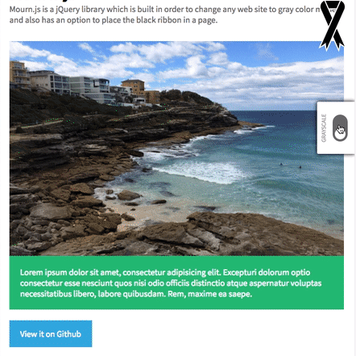

# Mourn.js

Mourn.js is a jQuery library which is built in order to change any web site to gray color mode
and also has an option to place the black ribbon in a page.



## Version 0.0.17
- fix z-index in elements (.mourn-ribbon and .switch-container)

## Version 0.0.15

Files
* src/css/mourn.css
* src/css/mourn.min.css
* src/js/mourn.js
* src/js/mourn.min.js
* example.css
* example.html

## Quick start

* [Download the latest version](https://github.com/kanmanus/mourn.js/archive/master.zip)
* Clone the repo: git clone https://github.com/kanmanus/mourn.js.git
* Install with npm: ```npm install mourn.js```
* Install with bower: ```bower install mourn.js```

## Demo

[try now!](http://www.kanmanus.com/mournjs/example.html)

## Installation

### Step 1: Link required files

First, add a link to the css file in your ```<head>```:
```html
<!-- Mourn.js CSS file -->
<link rel="stylesheet" type="text/css" href="src/css/mourn.css">
```

Then, before your closing ```<body>``` tag add:
```html
<!-- jQuery library (served from Google) -->
<script src="https://ajax.googleapis.com/ajax/libs/jquery/1.11.3/jquery.min.js"></script>
<!-- Mourn.js Javascript file -->
<script type="text/javascript" src="src/js/mourn.js"></script>
```

### Step 2: Call the Mourn.js

With a simple call below, your web site will become to gray color mode and has a mourning ribbon on the page.
```javascript
$(document).ready(function(){
  $.mourn();
});
```

## Configuration options

### Options

The Mourn.js has several properties that you can customize.
Noted that the options you'll see below are default options of this library.

```javascript
$.mourn({
  // Gray Color Mode Options
  gray: true,                      // boolean: [true|false]
  grayScale: 1.0                   // double: [0.0 ~ 1.0]

  // Ribbon Options
  ribbon: true,                    // boolean: [true|false]
  ribbonSize: 'large',             // String: [small|large]
  ribbonPosition: 'top-right',     // String: [top-left|top-right|bottom-left|bottom-right]
});
```

## Supported Browsers

mourn.js is designed to support the latest web browser. We support the current versions of Chrome, Firefox and Safari

========================================================================================

Copyright (C) 2016 | Developed by Kanmanus Ongvisatepaiboon, Songklod Saengvoratip, Phruek Kosonsuwiwat.

Co-Advisor: Teeradech Thanapop, Nathawat Thumthiwong, Suthat Ronglong
